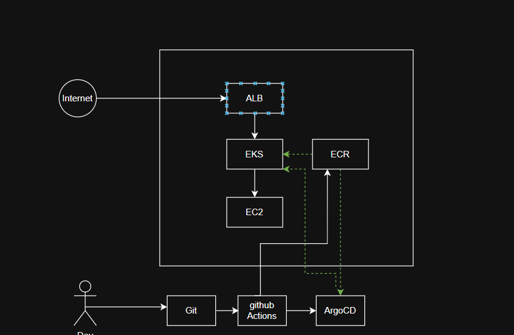
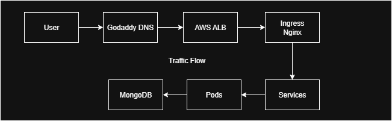
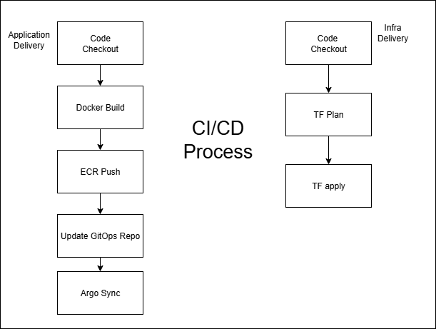

# Full-Stack Cloud-Native Application

This repository contains the source code for a full-stack application built using modern DevOps principles with automated CI/CD and GitOps deployment strategies across staging and production environments.

---

## Technologies Used

- **Cloud Provider:** AWS (VPC, S3, EKS, EC2, ALB, ECR)
- **CI/CD:** GitHub Actions
- **GitOps Delivery:** ArgoCD
- **IaC:** Terraform
- **Containers:** Docker
- **Monitoring:** Prometheus, Grafana
- **Database:** MongoDB (on EC2)

---

## System Architecture

> **Note:** For complete technical breakdown and architecture deep-dive, refer to [`architecture/README.md`](./architecture/README.md).

---

## Traffic Flow

---

##  CI/CD Process

---

## Git Workflow

### Branching Strategy

- `feature/*`: Developer feature branches.
- `staging-frontend`, `staging-backend`: Full SDLC (CI + CD) is automated here.
- `release-frontend`, `release-backend`: GitOps updates to `main` for production; CD is manual via ArgoCD.
- `infra`: Triggers Terraform workflows for infrastructure changes.

### GitHub Actions Workflows

| Branch                   | Workflow Triggered        | Description                              |
|--------------------------|---------------------------|------------------------------------------|
| `staging-frontend`       | Frontend CI               | Full SDLC to staging                     |
| `staging-backend`        | Backend CI                | Full SDLC to staging                     |
| `release-frontend`       | Frontend Release          | GitOps update to `main` (prod)           |
| `release-backend`        | Backend Release           | GitOps update to `main` (prod)           |
| `infra`                  | Terraform Deploy/Destroy  | Infra provisioning or teardown           |

---

## Deployment Strategy

| Environment | Namespace     | Deployment Mode        | ArgoCD Sync Type         |
|-------------|----------------|------------------------|--------------------------|
| Staging     | `staging`      | Continuous Deployment  | Auto Sync                |
| Production  | `production`   | Continuous Delivery    | Manual Trigger Required  |

Helm charts for both frontend and backend are maintained in the [GitOps Repo](https://github.com/zubairzb/demo-gitops).

---

## Application Access

| Service           | URL                                 | Auth                          |
|------------------|--------------------------------------|-------------------------------|
| ArgoCD           | https://deploy.zbteky.shop           | `admin` / `admin123`          |
| Grafana          | https://deploy.zbteky.shop/grafana   | `devops-user` / `devops@demo25` |
| Prod - Frontend  | https://app.zbteky.shop              | Signup/Login                  |
| Prod - Backend   | https://api.zbteky.shop              | API Access                    |
| Staging - Frontend | https://app-staging.zbteky.shop     | Signup/Login                  |
| Staging - Backend | https://api-staging.zbteky.shop      | API Access                    |

---

## Notes

- Images are built during CI (staging branches) and pushed to ECR.
- In production, the same image is reused, only GitOps repo is updated.
- Terraform workflows are isolated under the `infra` branch.

