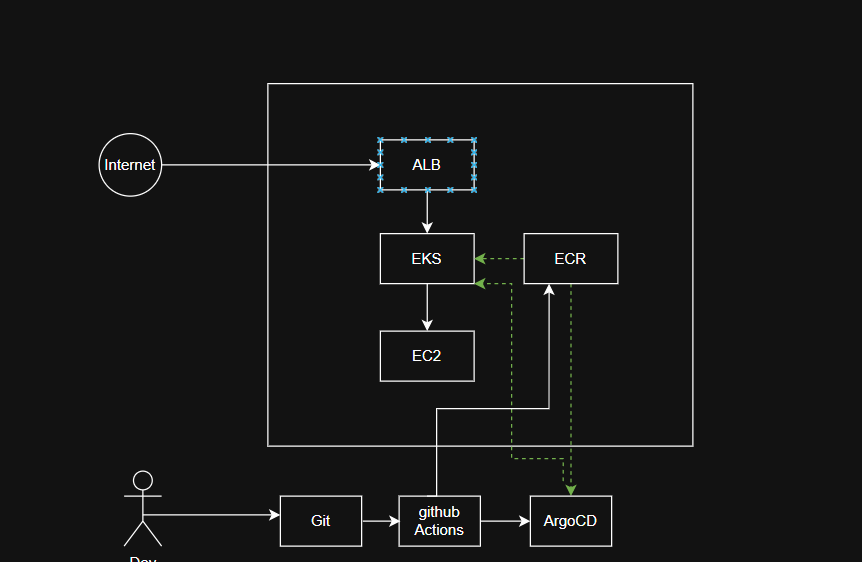
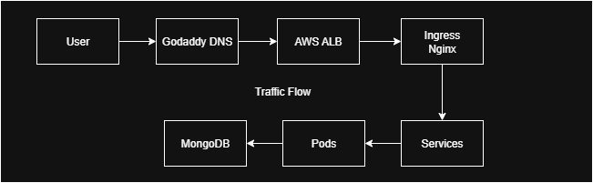

# Cloud-Native DevOps Architecture

This document presents a complete system architecture, traffic flow, and CI/CD pipeline using AWS EKS, GitHub Actions, and ArgoCD.

---

## System Architecture

This diagram shows:
- Public access via AWS ALB
- EKS hosting application workloads
- MongoDB hosted on EC2
- ECR integration for Docker image pulls
- GitHub Actions + ArgoCD for GitOps delivery

---

## Traffic Flow

**Flow Explanation:**

- DNS handled via **GoDaddy**
- Requests routed through **AWS ALB**
- Ingress managed by **NGINX**
- Application pods communicate with MongoDB

---

## CI/CD Process

**Two Parallel Pipelines:**

- **Application Delivery:**
  - Code → Docker build → ECR → GitOps Repo → ArgoCD sync

- **Infrastructure Delivery:**
  - Terraform Plan → Apply

---

